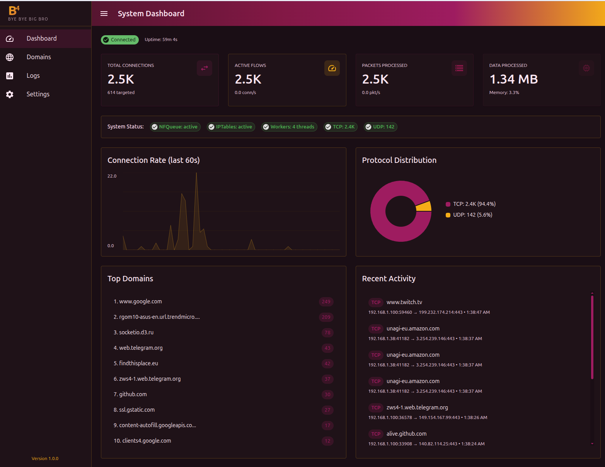

# B4 - Bye Bye Big Bro

A high-performance network packet processor for DPI (Deep Packet Inspection) circumvention, built with Go and featuring a modern web UI interface.



## Overview

B4 is a `netfilter` queue-based packet processor designed to bypass DPI systems by fragmenting and obfuscating TLS/QUIC traffic. It intercepts packets at the kernel level, analyzes SNI (Server Name Indication) patterns, and applies various evasion techniques to maintain privacy and access to restricted content.

## Features

- **SNI-based Traffic Processing**: Intelligently detects and processes `TLS ClientHello` and `QUIC` Initial packets
- **Multiple Evasion Strategies**:
  - TCP fragmentation (split packets at strategic positions)
  - IP-level fragmentation
  - Fake SNI packet injection with multiple strategies (TTL manipulation, sequence randomization, checksum corruption)
  - UDP/QUIC handling with configurable fake packet generation
- **Domain Filtering**: Support for geodata-based domain categorization using `geosite.dat` files
- **Real-time Monitoring**: Built-in web interface for live log viewing and connection tracking
- **High Performance**: Multi-threaded netfilter queue processing with configurable worker pools
- **Flexible Configuration**: Extensive CLI flags and JSON configuration support

## Prerequisites

- Linux kernel with netfilter support
- Root/CAP_NET_ADMIN privileges
- Go 1.24+ (for building)
- Node.js 18+ and pnpm (for building web UI)
- `iptables` and `ip6tables`

## Installation

`comming soon`

## Quick Start

```bash
# Basic usage - intercept all traffic
sudo b4

# With domain filtering
sudo b4 --sni-domains youtube.com,facebook.com

# Using geodata categories
sudo b4 --geosite /opt/sbin/geosite.dat --geo-categories youtube,facebook,twitter

# Enable web interface
sudo b4 --web-port 7000

# Custom configuration
sudo b4 --queue-num 537 --threads 8 --verbose debug
```

## Configuration

### Command-Line Flags

#### Network Configuration

- `--queue-num` - Netfilter queue number (default: 537)
- `--threads` - Number of worker threads (default: 4)
- `--mark` - Packet mark value (default: 32768)
- `--connbytes-limit` - Connection bytes limit (default: 19)

#### Geodata Filtering

- `--geosite` - Path to geosite.dat file
- `--geo-categories` - Categories to process (e.g., youtube,facebook)
- `--sni-domains` - Comma-separated list of domains (can be used as additional list together with `--geo-categories`)

#### TCP Fragmentation

- `--frag` - Fragmentation strategy: tcp/ip/none (default: tcp)
- `--frag-sni-reverse` - Reverse fragment order (default: true)
- `--frag-middle-sni` - Fragment in middle of SNI (default: true)
- `--frag-sni-pos` - SNI fragment position (default: 1)

#### Fake SNI Configuration

- `--fake-sni` - Enable fake SNI packets (default: true)
- `--fake-ttl` - TTL for fake packets (default: 8)
- `--fake-strategy` - Strategy: ttl/randseq/pastseq/tcp_check/md5sum (default: pastseq)
- `--fake-seq-offset` - Sequence offset for fake packets (default: 10000)
- `--fake-sni-len` - Length of fake SNI sequence (default: 1)
- `--fake-sni-type` - Payload type: 0=random, 1=custom, 2=default

#### UDP/QUIC Configuration

- `--udp-mode` - UDP handling: drop/fake (default: drop)
- `--udp-fake-seq-len` - UDP fake packet sequence length (default: 6)
- `--udp-fake-len` - UDP fake packet size in bytes (default: 64)
- `--udp-faking-strategy` - Strategy: none/ttl/checksum (default: none)
- `--udp-dport-min` - Minimum UDP destination port (default: 0)
- `--udp-dport-max` - Maximum UDP destination port (default: 0)
- `--udp-filter-quic` - QUIC filtering: disabled/all/parse (default: parse)

#### System Configuration

- `--gso` - Enable Generic Segmentation Offload
- `--conntrack` - Enable connection tracking
- `--skip-iptables` - Skip iptables rules setup
- `--seg2delay` - Delay between segments in ms (default: 0)

#### Logging

- `--verbose` - Verbosity level: debug/trace/info/silent (default: info)
- `--instaflush` - Flush logs immediately (default: true)
- `--syslog` - Enable syslog output

#### Web Server

- `--web-port` - Port for web interface (0 disables) (default: 0)

### Configuration File

B4 can save and load configuration from `b4.json`:

```json
{
  "queue_start_num": 537,
  "threads": 4,
  "web_server": {
    "port": 7000
  },
  "logging": {
    "level": "info",
    "instaflush": true,
    "syslog": false
  }
}
```

## Web Interface

Access the web interface at `http://your-router-ip:7000` (configure port with `--web-port`).

Features:

- **Domains**: Real-time table of intercepted connections with protocol, SNI, source/destination
- **Logs**: Live streaming logs with filtering and search
- **Settings**: Configuration management (under development)

## Advanced Usage

### Using Geodata Files

Download geosite/geoip files (for example, [v2ray-rules-dat](https://github.com/Loyalsoldier/v2ray-rules-dat)):

```bash
wget https://github.com/Loyalsoldier/v2ray-rules-dat/releases/latest/download/geosite.dat
wget https://github.com/Loyalsoldier/v2ray-rules-dat/releases/latest/download/geoip.dat

sudo b4 --geosite geosite.dat --geo-categories youtube,netflix,google
```

### Custom Fake Packet Strategies

```bash
# TTL manipulation (fake packets expire before reaching destination)
sudo b4 --fake-strategy ttl --fake-ttl 5

# Random sequence numbers (confuse state tracking)
sudo b4 --fake-strategy randseq

# Past sequence numbers (appear to be retransmissions)
sudo b4 --fake-strategy pastseq --fake-seq-offset 8192

# TCP checksum corruption
sudo b4 --fake-strategy tcp_check
```

## Troubleshooting

### No packets being processed

- Verify iptables rules: `sudo iptables -t mangle -vnL --line-numbers`
- Check queue status: `cat /proc/net/netfilter/nfnetlink_queue`
- Ensure proper permissions (run as root)

### Web interface not accessible

- Check if port is open: `sudo netstat -tlnp | grep 7000`
- Verify `--web-port` is set
- Check firewall rules

### High CPU usage

- Reduce thread count: `--threads 2`
- Limit processed domains with more specific filters
- Use `--skip-iptables` if managing rules manually

## Development

### Building Development Version

`comming soon`

### Running Tests

`comming soon`

## Credits

Inspired by and builds upon:

- [youtubeUnblock](https://github.com/Waujito/youtubeUnblock)
- [GoodbyeDPI](https://github.com/ValdikSS/GoodbyeDPI)
- [zapret](https://github.com/bol-van/zapret)

## License

This project is provided as-is for educational purposes. Users are responsible for compliance with local laws and regulations.

## Contributing

Contributions are welcome! Please:

1. Fork the repository
2. Create a feature branch
3. Make your changes
4. Submit a pull request

## Disclaimer

This tool is intended for bypassing censorship and protecting privacy in regions where internet access is restricted. It should not be used for **illegal activities**. `The authors are not responsible for misuse of this software`.
